A screenshot to select Workspace settingsf

# Contents

**Introduction**

**Lab Credentials:**

Troubleshoot Snowflake Login Issues

**Links to Labs:**

**Import Dataflow Template:**

Things to consider before importing from Dataflow Template

How to import Dataflow Template

**Create Views using T-SQL**

**Forecast ML Demo**

Requirement

How to create a Notebook

Add Lakehouse to the Notebook

Install Python Library In-line

Run code to create forecast

**Data Activator Demo**

Requirement

Scenario

Add Sales Variance % Measure

Create table visual

Create Activator

Overview of Activator

Send a test alert

**Semantic Link Demo**

Requirement

Scenario

Best practice analyzer

Memory analyzer

# **Introduction**

This document provides a guideline for the following features:

- Lab Credentials

- How to import Dataflow template

- Steps for Forecast ML Demo

- Steps for Data Activator Demo

- Steps for Data Mirroring Demo

**Disclaimer:** please note that as the product is changing daily, some screenshots may be out of date. We will work to get them fixed in the next update.

# **Lab Credentials:**

If any of the attendees choose to complete the labs in an alternate environment, here are the credentials you may need to share.

Attendees will need the username and password associated with their Lab account to connect to Dataverse and SharePoint

1.  **Username:** TE_SNOWFLAKE1

2.  **Password:** 8UpfRpExVDXv2AC1

3.  **SAS Token:** ?sv=2023-01-03&ss=btqf&srt=sco&st=2025-06-30T10%3A15%3A46Z&se=2026-06-30T10%3A15%3A00Z&sp=rl&sig=hVeyxY4F72YVH3X%2BlnIvVTg8M%2FwZgLIhDzBgHlv1580%3D

    > **Note**: If you encounter any issues connecting to Snowflake using the credentials from the environment details, please use the credentials provided below.

    - **Snowflake Username:** SNOWFLAKE_BACKUP

    - **Snowflake Password:** 8UpfRpExVDXv2AC1

    

### Troubleshoot Snowflake Login Issues

If attendees have issues logging into Snowflake, please follow the below steps. This will provide a detailed error description.

1.  Open a new browser window. Navigate to **dlhdzca-bab11165.snowflakecomputing.com**. This is the snowflake server we are using.

2.  Enter the **credentials**. If there is an error, you will get a detailed error description as shown in the screenshot below.

    

3.  If the error persists, we have **Snowflake data** **available in Azure Data Lake** and have a Dataflow template (**df_Supplier_ADLSGen2.pqt**) located in **C:\FAIAD\Solutions**. You can help the attendees to follow the steps below to import this template.

# **Links to Labs:**

- [Brazilian-Portuguese](https://experience.cloudlabs.ai/#/labguidepreview/aab00958-5596-4175-9bc9-39ece2586314)

- [Chinese](https://experience.cloudlabs.ai/#/labguidepreview/3c8f94bd-6936-4a18-a1e3-8b606402531e)

- [English](https://experience.cloudlabs.ai/#/labguidepreview/b63b312d-0c58-4fd0-bee1-05a94affa927)

- [French](https://experience.cloudlabs.ai/#/labguidepreview/e9c3e273-1dd1-4db8-80e3-aedfe41a1e9b)

- [German](https://experience.cloudlabs.ai/#/labguidepreview/e697a208-a982-4c6d-b32b-7e83d39c7186)

- [Italian](https://experience.cloudlabs.ai/#/labguidepreview/b984b3dd-928d-492e-be2c-de1d49dd2640)

- [Japanese](https://experience.cloudlabs.ai/#/labguidepreview/bb29b27d-7a77-4e4e-9c0d-a12a86397a1f)

- [Korean](https://experience.cloudlabs.ai/#/labguidepreview/544a6b13-8546-454d-8270-3540fe6a9566)

- [Spanish](https://experience.cloudlabs.ai/#/labguidepreview/16998c52-2637-4c65-b691-0fa5ac9091d7)

# **Import Dataflow Template:**

As the instructor, you can choose to let attendees have the option to import Dataflow templates. Here are the steps to import a template.

### Things to consider before importing from Dataflow Template

1.  If the student **already created the tables in the Lakehouse** - they need to first delete the table in the Lakehouse before loading the PQT (Otherwise they'll have to rename the table in the new Dataflow and then account for it later in the labs).

2.  The student needs to set up the destinations for the relevant tables - the "**enable staging**" checkmark is unchecked, but best to double check as in some instances it was still checked.

3.  The tables that require destinations in the df_Supplier_Snowflake are:

1.  Supplier

2.  PO

4.  The table that requires destination in the df_People_SharePoint is:

1.  People

### How to import Dataflow Template

1.  Navigate to the **Fabric workspace you created in Lab 2, Task 2** named **FAIAD\_ \<username\>**.

2.  From the menu, select **New Item -\> Dataflow Gen2**.

    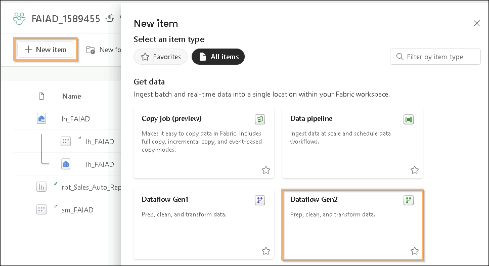

3.  Power Query window opens. In the center pane select **Import from a Power Query template**.

    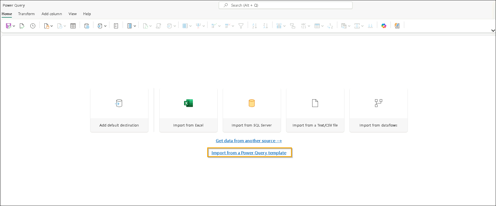

4.  Browse to **C:\FAIAD\Solutions** folder in the lab environment.

5.  Select the Dataflow you would like to import. Here we are importing **df_People_SharePoint.pqt**

6.  Select **Open**.

    Once imported, notice the query and all the steps for the query are imported. However, connection needs to be configured. Also, Data Destination needs to be set. Please follow the lab instructions to complete these steps.

    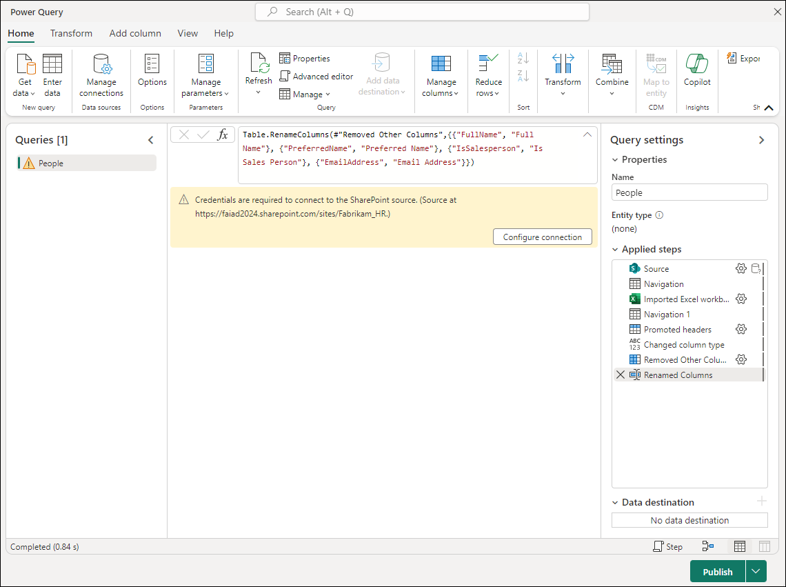

# **Create Views using T-SQL**

As the instructor, you can choose to let attendees create views using T-SQL. T-SQL for Geo, Product, Reseller and Sales views is available in the **Solutions** folder. Please open a new SQL query window in the Lakehouse and execute these T-SQL statements. If a view needs to be removed the Remove-View file is there to run also in the **Solutions** folder.

**Note**: These are CREATE statements. Any existing views with the same name has to be deleted before executing these statements.

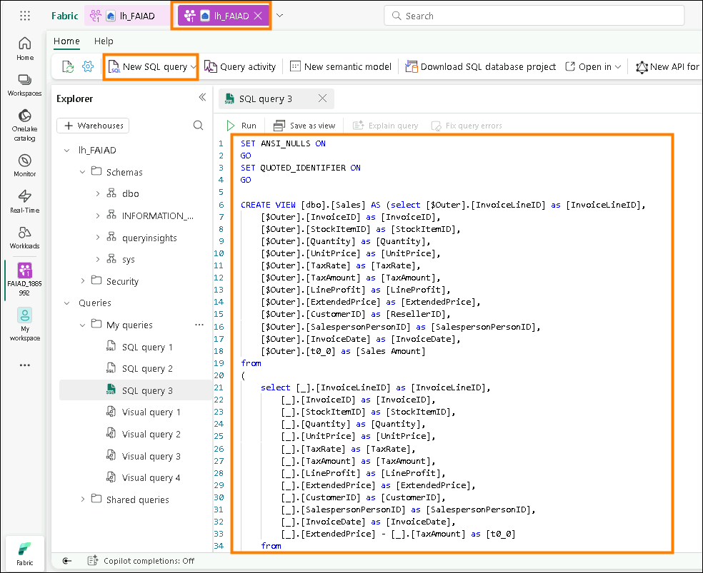

# **Forecast ML Demo**

### Requirement

It is required that you, the instructor, complete Labs 1-6 and all the data is ingested prior to advancing to the next steps.

For the demo, you need to install a python library called **prophet.** This can be installed either in-line in the notebook or you could create an environment. In this demo we will be using in-line mode.

### How to create a Notebook

1.  Navigate to the **Fabric workspace you created in Lab 2, Task 2** named **FAIAD\_ \<username\>**.

2.  From the menu, select **+** **New Item -\>** Use the search box to **search for Notebook -\>** Choose **Notebook**.

    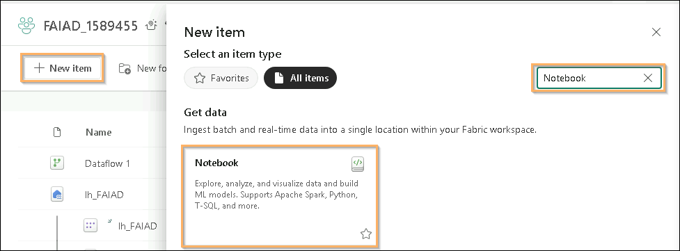

3.  Provide a **brief overview** of the layout: Notebook, language, environment, how to create a new cell, etc.

### Add Lakehouse to the Notebook

We need to associate a default Lakehouse to a notebook.

1.  In the Explorer panel select **Data Items** tab.

    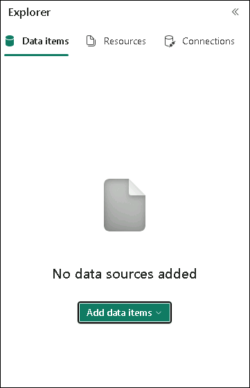

2.  Select **Add data items** from the Explorer panel.

3.  Select **From OneLake catalog**.
    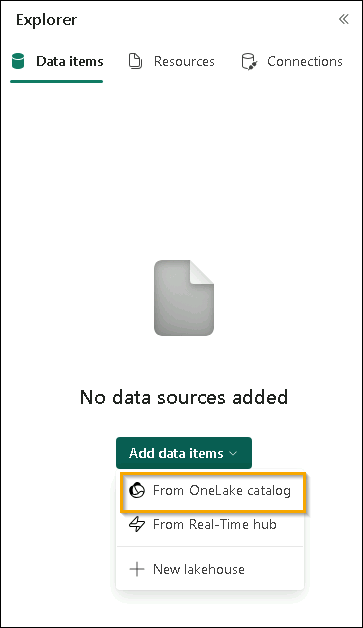

4.  OneLake data hub dialog opens. Select **lh_FAIAD** lakehouse.

5.  Select **Add**. Notice the Lakehouse is associated with the Notebook.

    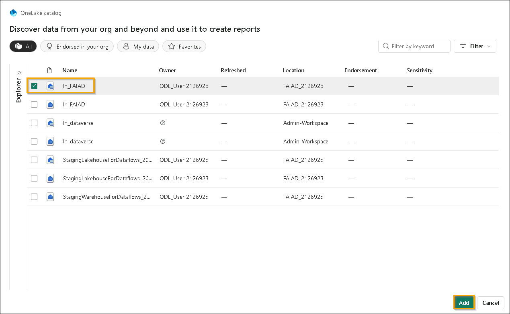

### Install Python Library In-line

For the demo, you need to install a python library called **prophet.** This is installed in-line.

1.  To **install the python library** enter the following code in the cell.

    !pip install prophet

2.  Execute the code by selecting the **Play** button next to the cell.

    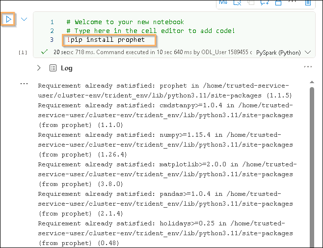

### Run code to create forecast

1.  Create a **new cell**.

2.  Enter the following **code**:

    from pyspark.sql import SparkSession

    from pyspark.sql.functions import month, year, col

    from prophet import Prophet

    import pandas as pd

    \# Initialize Spark session

    spark = SparkSession.builder.appName("Prophet Forecasting").getOrCreate()

    \# Load data from your specific Spark table

    df = spark.sql("SELECT \* FROM lh_FAIAD.Invoices i JOIN lh_FAIAD.InvoiceLineItems il ON i.InvoiceID = il.InvoiceID")

    \# Aggregate data to monthly level

    monthly_df = df.withColumn("Month", month("InvoiceDate"))\\

    .withColumn("Year", year("InvoiceDate"))\\

    .groupBy("Year", "Month")\\

    .sum("Quantity")\\

    .orderBy("Year", "Month")

    \# Convert to Pandas DataFrame and prepare for Prophet

    pandas_df = monthly_df.toPandas()

    pandas_df\['ds'\] = pd.to_datetime(pandas_df\[\['Year', 'Month'\]\].assign(DAY=1))

    pandas_df\['y'\] = pandas_df\['sum(Quantity)'\]

    \# Fit the Prophet model

    model = Prophet(yearly_seasonality=True, weekly_seasonality=False,daily_seasonality=False)

    model.fit(pandas_df\[\['ds', 'y'\]\])

    \# Create a DataFrame for future predictions (e.g., next 12 months)

    future = model.make_future_dataframe(periods=12, freq='M')

    \# Forecast

    forecast = model.predict(future)

    \# Plotting the forecast

    model.plot(forecast)

    model.plot_components(forecast)

3.  Explain each step of the **code** (hints provided as comments).

4.  Execute the code by selecting the **Play** button next to the cell.

    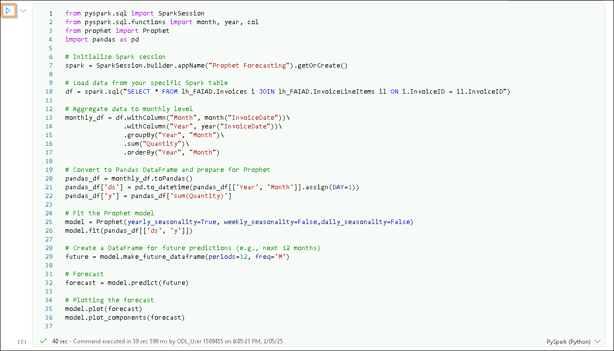

    Walk the attendees through the three charts that are created (below). We have actuals through May 2023 and we are forecasting for 12 months.

    Notice the **first chart** removes seasonality and forecasts through April 2025.

    The **second chart** removes trend and adds seasonality to forecasts through April 2025.

    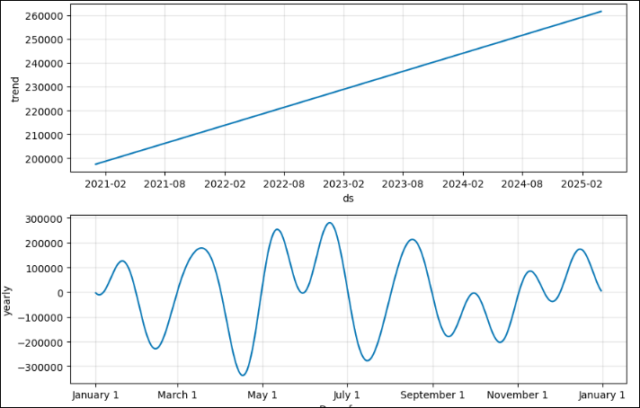

    The **third chart** forecasts using both trend and seasonality. This chart provides the upper and lower bound as well.

    

5.  Create a **new cell**.

6.  Add the following **code** to the cell:

    display(forecast)

    \#write forecast data to a table

    spark.createDataFrame(forecast).write.saveAsTable("Sales_Forecast", mode="overwrite")

7.  Execute the cell by selecting the **Play** button.

    

8.  Walk the attendees through the **data that is displayed**.

9.  Show the users that a new table has been created in the Lakehouse: **sales_forecast**

    

10. **Query** the table and show users the content of the table.

# **Data Activator Demo**

### Requirement

It is required that you, the instructor, complete Labs 1-7 prior to advancing to the next steps.

The following links will have the latest updates.

<https://learn.microsoft.com/en-us/fabric/data-activator/data-activator-introduction>

<https://learn.microsoft.com/en-us/fabric/data-activator/data-activator-get-data-power-bi>

### Scenario

We know that there is variance in Sales by Stock Group Name each month. This is due to seasonality. However, we would like to be notified if the Variance % is below 20%. This will help with identifying and resolving such scenarios.

To solve this, we are going to use Data Activator. We are going to trigger an alert when the Sales Variance % of any of the Stock Group Name drops below 20%. We are going to simulate this for May 2024. As Data Activator trigger runs hourly, instead of waiting for an hour we are going to execute a test alert.

To demo this scenario, we are going to:

- Add Sales Variance % measure to the dataset.

- Add a table visual showing Sales Variance % by Stock Group Name. Filter this table to May 2024.

- Create an alert using the table visual.

- Examine the Activator and create a test alert.

### Add Sales Variance % Measure

We are going to add a new measure to sm_FAIAD semantic model.

1.  Navigate to **sm_FAIAD** semantic model.

2.  Select **Sales** table.

3.  From the top menu select **Home -\> New measure**.

4.  Create the below **measure**. This is going to provide Variance % compared to Prior month.

    Sales Var % =

5.  var priormth = CALCULATE(\[Sales\], PREVIOUSMONTH('Date'\[Date\]))

6.  RETURN DIVIDE(\[Sales\]-priormth, priormth)

7.  **Format** the measure as a **Percentage**.

    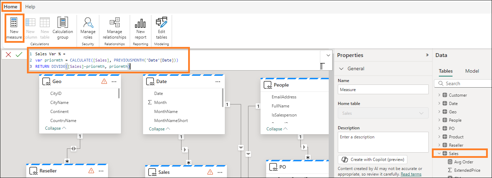

### Create table visual

We are going to edit rpt_Sales_report and add a new table visual. The table visual will show the Sales Variance % by Stock Group Name for May 2023.

1.  Navigate to **rpt_Sales_report** (created in Lab 7).

2.  From the top menu select **Edit**.

3.  From the Data view, expand **Product** table.

4.  Select **StockGroupName** field. A table visual is created.

5.  Expand **Sales** table.

6.  Select **Sales Var %**. Notice there is no data in the table visual. This is because Sales Var % needs a month name to calculate.

    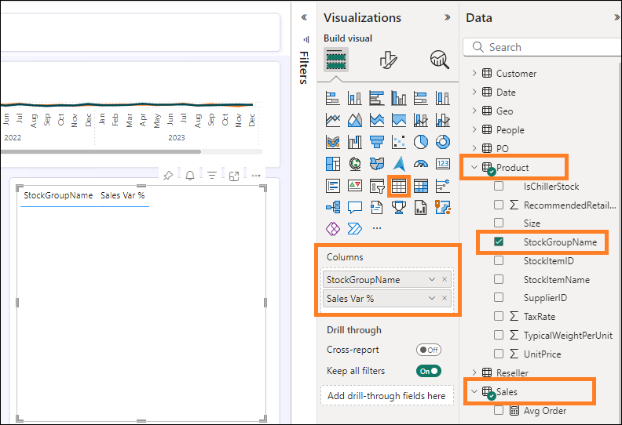

7.  **Expand** **Filter** section (if it is collapsed).

8.  With the table visual highlighted, from the **Data** section expand **Date** table.

9.  Drag **Year** field into Filters on this visual section.

10. For the **Year** field, select **Basic filtering** from the **Filter type** dropdown.

11. Select **2024**.

    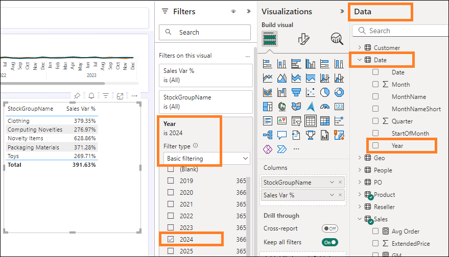

12. Drag **MonthNameShort** field into Filters on this visual section.

13. Select **May.**

14. Select **File -\> Save** to save the updates to the report.

    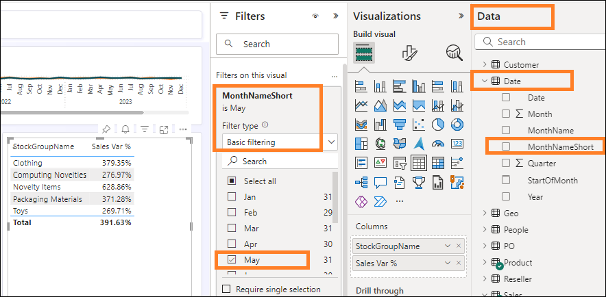

### Create Activator

We are going to create an Activator which is going to send an alert if the Sales Variance % for any of the Stock_Group_Name is under -20%. Notice Toys Stock Group Name has Sales Variance % of -26.22% and meets the alert criteria.

1.  With the newly created table visual highlighted, select the **Alert Bell** on the top left of the visual.

    

2.  Set an alert panel opens.

3.  Talk to attendees that the alert is applied **For each Stock_Group_Name**

4.  Select **Sales Var %** under **Alert when a row changes.**

    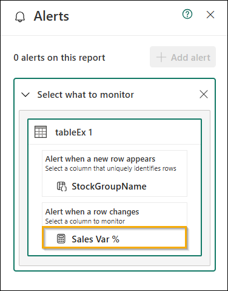

5.  Select the **Becomes** radio button, and change the **Condition** to **Less Than.**

6.  Set **Threshold** to **-20%**. This is to configure the trigger to alert when the Sales Variance % drops below 20%.

    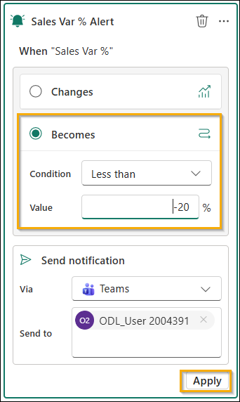

7.  Talk about the two options for notification, Email and Teams.

8.  Select **Apply**

9.  At the bottom, next to **My Power BI Activator Alerts**, select the **ellipses (…).**

10. Show the different Workspace save locations.

    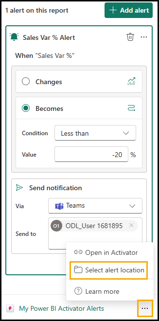

11. Once the alert is created, you can also select **Open in Activator** after clicking the bottom ellipses.

    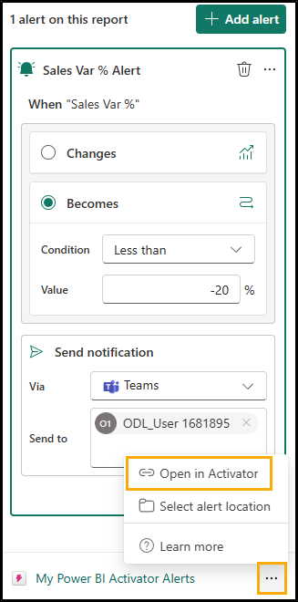

### Overview of Activator

1.  You will be navigated to the **Design** view of the Activator.

2.  Walk the attendees through the **layout**, on the left are the objects. Notice there is a **Trigger** we just created. There is also **Events** section.

3.  With the Trigger we created selected, talk about the options in the **top menu**.

1.  Home

1.  Get data

2.  Create Custom Actions using Power Automate

2.  Rules

1.  Delete

2.  Start, Stop, View details

3.  Send me a test action

4.  Talk about the **Monitor** and **Condition** charts that are contained within the **Definition** tab.

5.  As you scroll down, notice in the **Action** chart, this is where the alert would notify you once it is triggered. Currently triggers run hourly. So in the next hour if the data changes and the condition is satisfied an alert is triggered.

    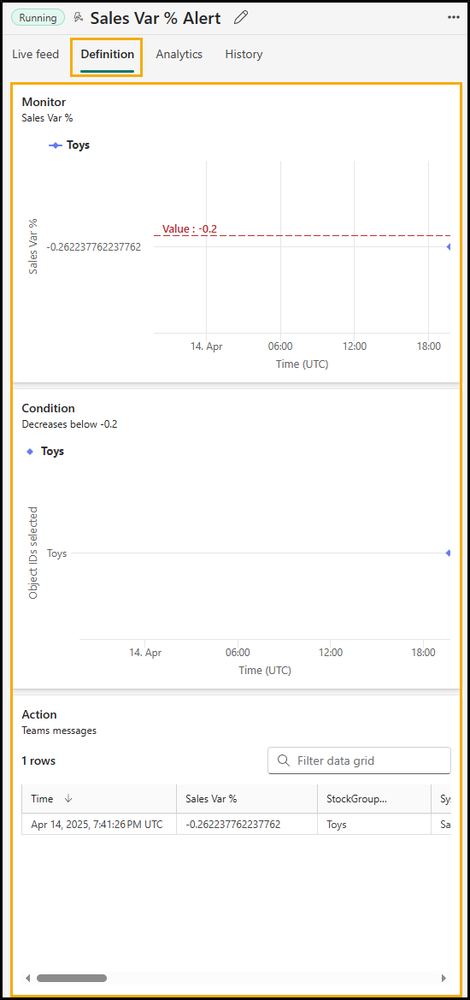

6.  On the right side of the screen, you will have the option to configure the **Alert’s Definition**. This includes the Attribute, any filters or summarization, conditions, and Action. Notice the alert is defaulted to the Lab user account. (external email address is not supported currently).

    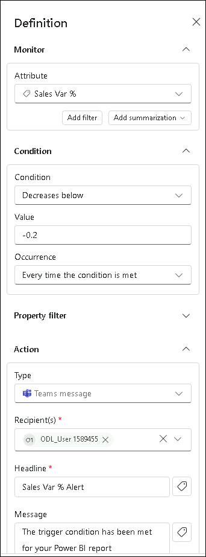

7.  Notice you can edit the action details here as well. If you choose the Edit Action button, and the Edit the action window pops up.

    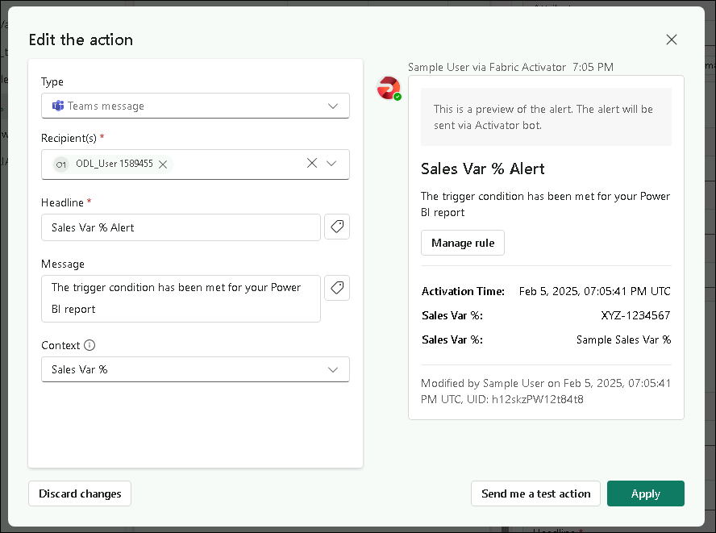

### Send a test alert

Note: To view the alert you have to use the lab environment.

1.  Select **Sales Var % trigger**.

2.  From the top menu select **Send me a test action**. This will send a test alert to your lab user account.

3.  Select the **App launcher icon** on the top left corner of the screen.

    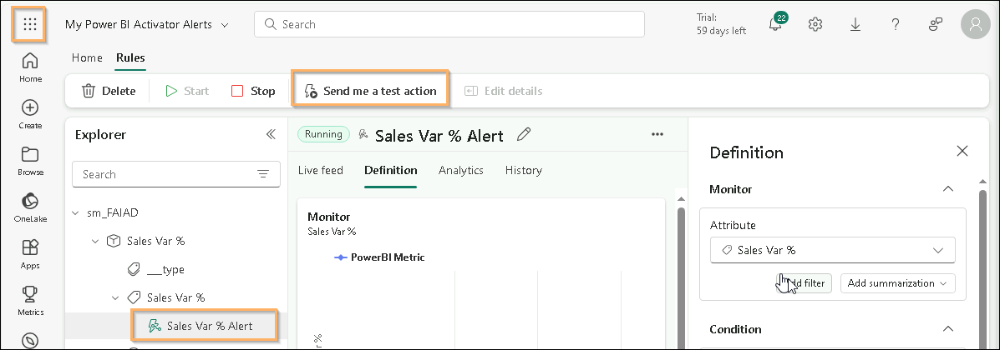

4.  Select Teams. A new browser window opens.

    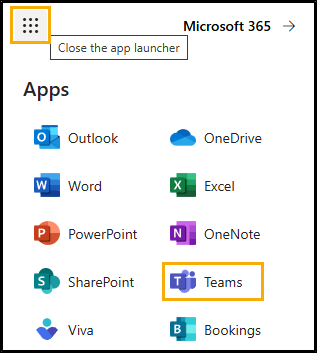

5.  You will receive an alert message (may take a few minutes). Notice this is a test action.

    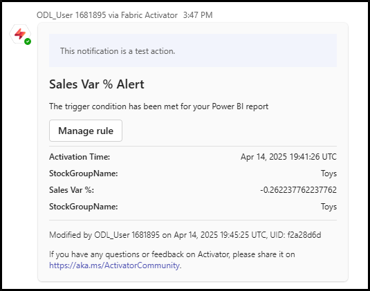

6.  As the data changes and the trigger condition is met, alerts are sent out.

    **Note:** To demo this feature, we filtered the visual for one month (May 2024). In real world scenarios, this will be dynamic. We will probably have a trigger set dynamically for the current month.

###

# **Semantic Link Demo**

### Requirement

It is required that you, the instructor, complete Labs 1-7 prior to advancing to the next steps.

It is recommended that the instructor executes the notebooks in this demo beforehand, as both notebooks can take between 5-10 minutes to complete. One option is executing the notebooks while students are working on lab 6/7. This is to ensure the instructor can show the students the results of the notebooks.

### Scenario

In this demo, we’ll explore the **Best Practice Analyzer** and the **Memory Analyzer**. These are powerful tools that help us evaluate our semantic model for performance, memory usage, and overall quality. These tools don’t just offer metrics; they offer **actionable insights to improve the design and efficiency** of your model by highlighting optimization opportunities you might otherwise miss.

At the heart of this capability is **Semantic Link** - a feature in Microsoft Fabric that lets us connect our semantic models directly with data science tools and experiences. This means we can **analyze, profile, and optimize** our sm_FAIAD semantic model with Notebooks.

Because of this connection, we can run in-depth analysis such as best practice checks and memory profiling directly against the semantic model in our workspace. This empowers us to improve **performance, reduce memory footprint, and ultimately lower cost** of your artifacts in production.

To demo this scenario, we are going to:

- Open our sm_FAIAD semantic model and find Semantic Link features.

- Create the best practice analyzer notebook and view insights.

- Create the memory analyzer notebook and view insights.

### Best practice analyzer

1.  Navigate to the **Fabric workspace you created in Lab 2, Task 2** named **FAIAD\_ \<username\>**.

2.  Open the **sm_FAIAD** semantic model.

    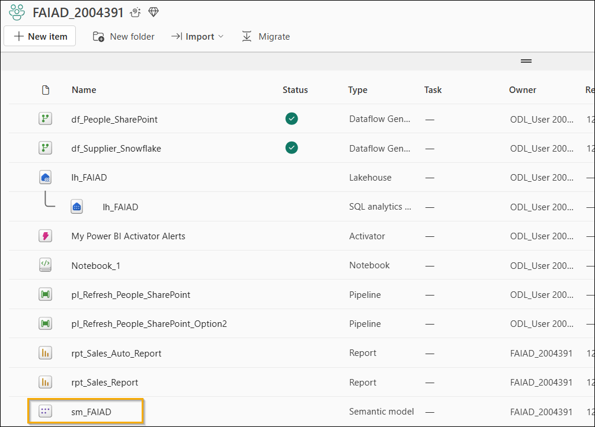

3.  On the next page, select **Open semantic model.**

    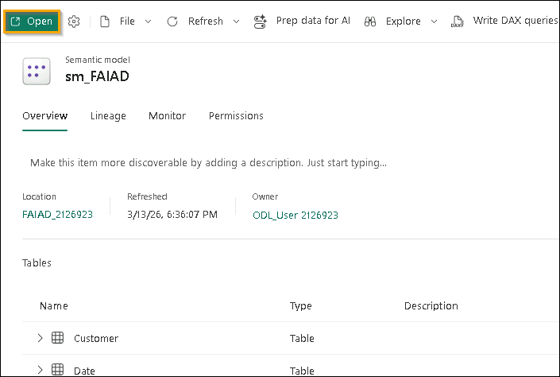

4.  In the **Home Ribbon** notice you have 3 items under **Model health**.

1.  **Best practice analyzer:** Offers tips to improve the design and performance of your semantic model based on rules created by Fabric experts.

2.  **Memory analyzer:** Provides memory and storage statistics about objects in your semantic model. Reviewing these statistics can help you identify areas of possible performance optimization and memory reduction.

3.  **Community notebooks:** Gallery of notebooks created by the Power BI community to enhance data analysis and reporting.

    *Note: These notebooks can also be found in the semantic model details page.*

5.  Click on **Best practice analyzer.**

    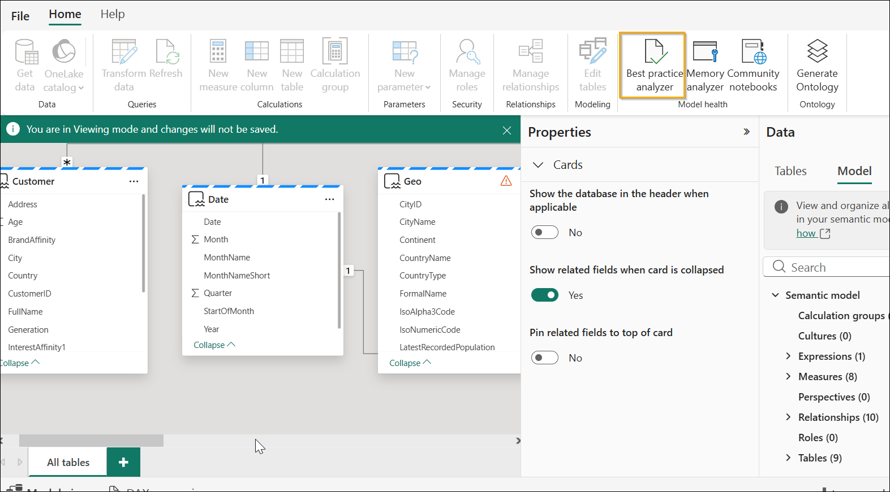

6.  A new best practice analyzer notebook will be created. You’ll be navigated to the notebook.

7.  Go over the details written in the Markdown cells with the students.

8.  In the home ribbon, select **Run all**.

    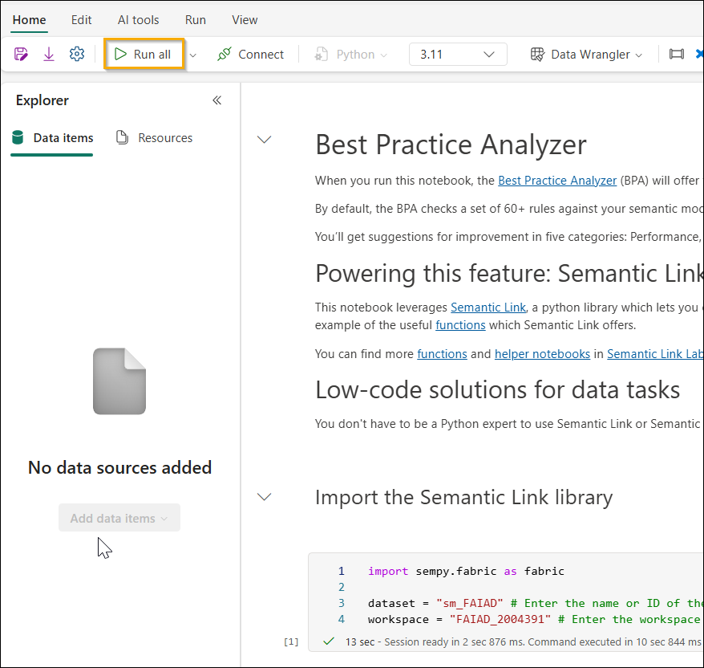

9.  Once the notebook has completed running, notice the result of the **run_model_bpa** function.

    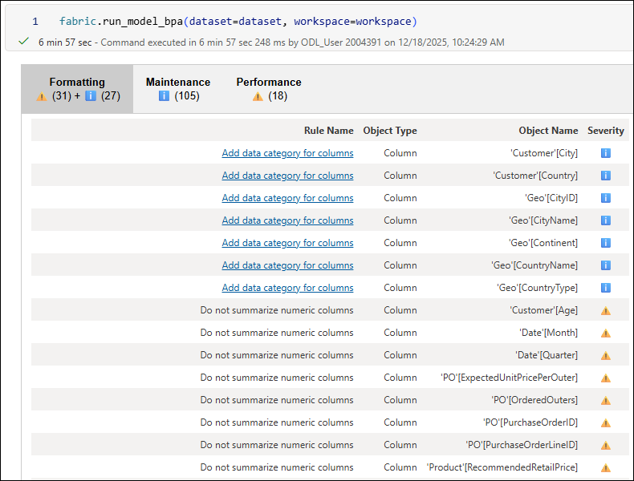

10. This function returns three categories of recommendations. **Formatting, Maintenance, and Performance.** Within a given category you will see two different icons representing the severity of the recommendation.

1.  ℹ️ - A recommended change that can improve your model.

2.  ⚠️ - This caution severity dictates that the issue listed could cause problems in your model or reports that use the model.

11. Under **Formatting,** scroll down and hover over the **Rule Name “Format flag columns as Yes/No value strings”**

12. Describe to students that hovering over rule names will provide more details about the recommended change.

    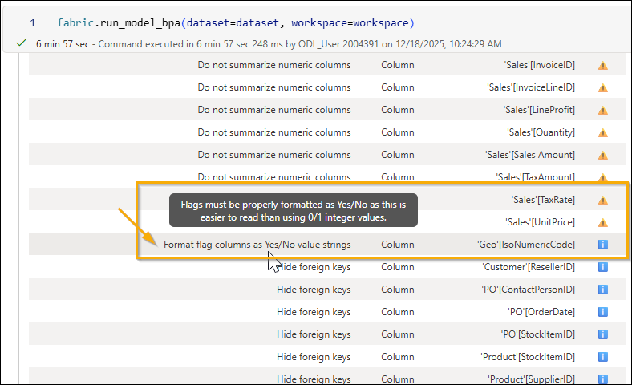

13. In this case the performance analyzer recommends we format the **IsoNumericCode** column in the **Geo** table to **Yes/No**. This is a great recommendation as formatting flag columns this way is a best practice when modeling a star schema.

14. Select the **Maintenance** category.

    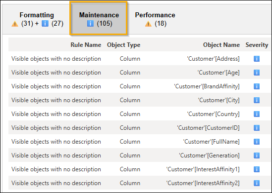

15. Note to the students that most of the maintenance recommendations are to add descriptions to our visible columns in the model.

16. Select the **Performance** category.

    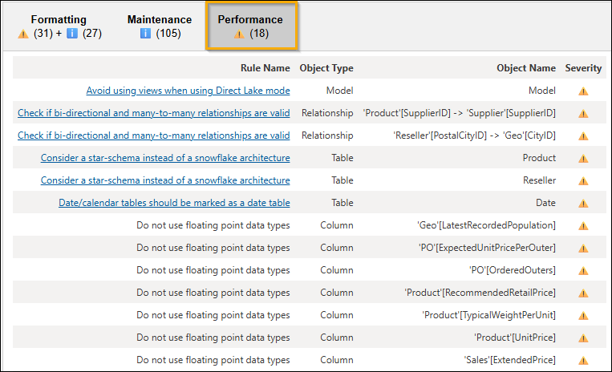

17. Hover over the **rule name “Avoid using views when using Direct Lake mode”**.

18. The performance analyzer is reminding us that Direct Lake mode does not support views. In this class we used shortcuts to quickly connect to data, then we transformed the data using views. In part, this was done to learn more about the many data connection methods we have in Fabric. However, if we wanted to apply this recommendation to our model we would need to use another method to ingest and transform our sales data, such as a Dataflow Gen2.

    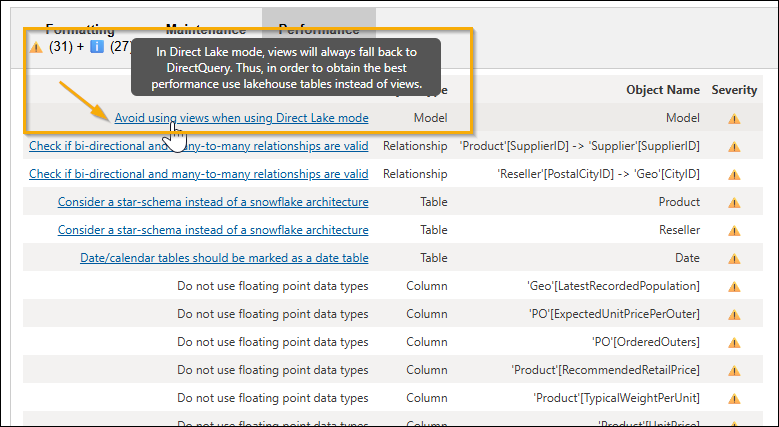

19. If time permits, the instructor can walk through other recommendations.

### Memory analyzer

1.  Navigate back to the model view of your **sm_FAIAD** semantic model.

2.  In the **Home Ribbon** select **Memory analyzer.**

    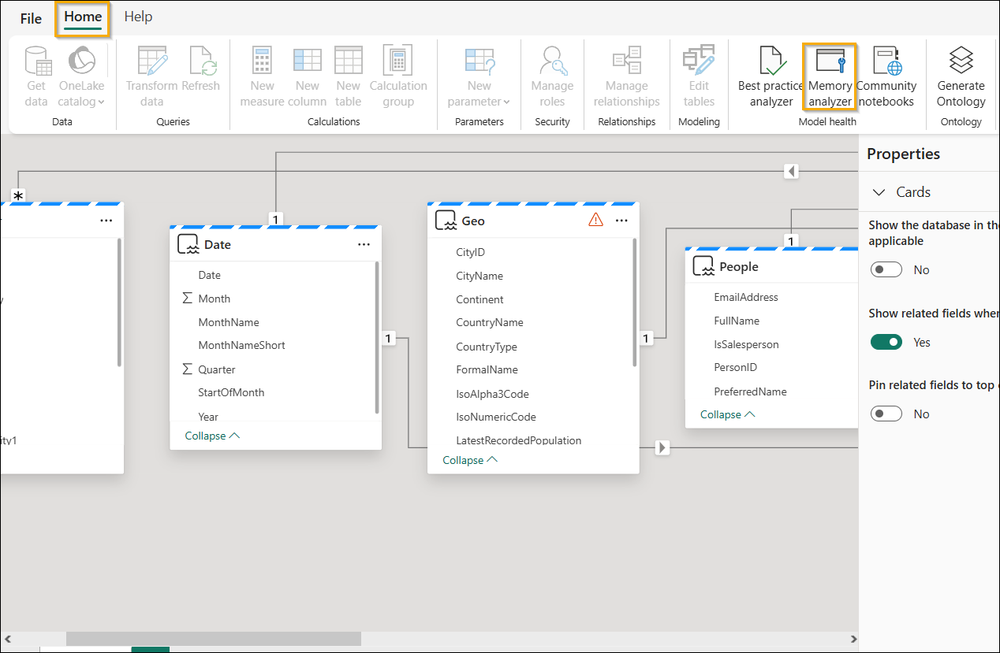

3.  A new Memory analyzer notebook will be created.

4.  Go over the details listed in the Markdown cells with students.

5.  In the **Home Ribbon,** select **Run all**.

    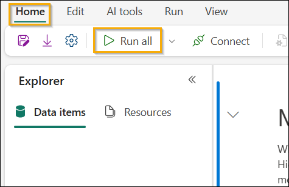

6.  After the notebook has completed, look at the resulting data. There are many categories displaying memory usage at varying levels of detail.

    

7.  Note to the students that we can use all this information to identify areas of improvement in regard to memory usage.

8.  Select the **Tables** category.

9.  Hover over the **% DB column** name. Doing so will display the columns description. This column indicates the size of each table relative to the size of the semantic model. While this does not automatically tell us that something is wrong, it is helpful to see what percentage of the semantic models memory is being used by each table.

    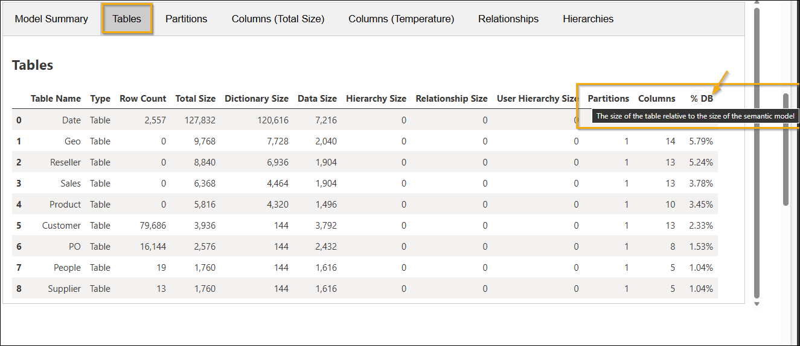

10. If time permits, the instructor can finish the demo going through other categories explaining various data points.
